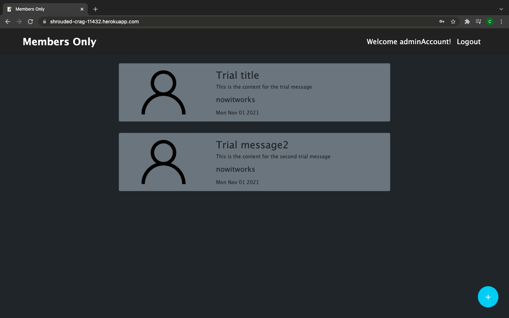

# Members Only

It is a message board where members can post their messages for everyone else to see, but only those who are members can see the authors of each message. If you want to be a member use the password authenticateMember once you have logged in and you'll be able to see the authors of the messages.

## Live Demo

[Click Here](https://shrouded-crag-11432.herokuapp.com/)

## Description

This was my first project working with authentication, I used PassportJS for this, along with bcrypt for hashing the passwords.

## Built With

- HTML/Pug
- CSS/Bootstrap
- JavaScript/NodeJS/Express
- MongoDB/Mongoose

## License

This project is licensed under the MIT License - see the LICENSE.md file for details.
